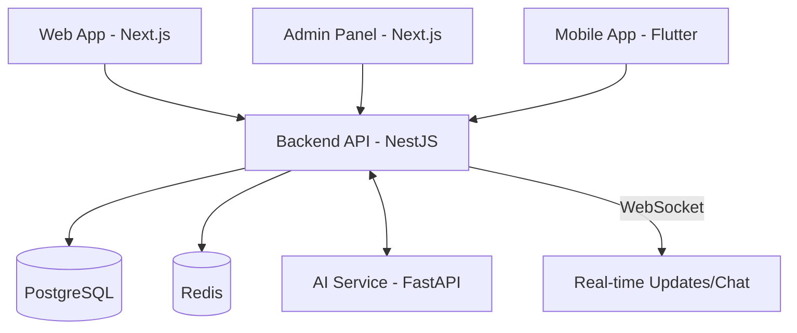

# System Architecture

Tayyibt is built as a **modular monolith** with a separate specialized **AI microservice**. This architecture allows for development simplicity while preparing the system for future scaling into a full microservices environment.

## High-Level Design

The system consists of three client applications communicating with a central Backend API, which in turn interacts with databases and a specialized AI service.

## Service Responsibilities

### 1. Backend API (NestJS)
- **Authentication & Authorization:** Handles user registration, login, and token management.
- **User Management:** Profile creation, updates, and search logic.
- **Social Features:** Groups, posts, comments, and notifications.
- **Communication:** Real-time chat via WebSockets and persistent message storage.
- **Business Logic:** Orchestrates matching, subscriptions, payments, and reporting.

### 2. AI Service (FastAPI)
- **Feature Extraction:** Processes user profile data into numerical features for comparison.
- **Scoring Engine:** Applies a weighted algorithm to calculate compatibility scores (0-100%).
- **Match Reasoning:** Generates human-readable reasons for a match (e.g., "Shared interests in travel").

### 3. Client Applications
- **Web/Mobile:** User-facing interfaces for interacting with the platform.
- **Admin Dashboard:** Specialized interface for platform administrators to moderate content and users.

## Communication Patterns
- **Synchronous (REST):** Most client-to-server and server-to-server (AI service) communication uses RESTful APIs.
- **Real-time (WebSockets):** Chat messages and live notifications are delivered via Socket.IO.
- **Database Access:** The backend uses TypeORM to interact with PostgreSQL and a Redis client for caching and session management.

## Security Architecture
- **JWT Authentication:** Secure stateless authentication with short-lived access tokens and longer-lived refresh tokens.
- **Data Encryption:** Sensitive data (like chat messages) is intended to be encrypted.
- **API Protection:** Rate limiting and input validation are implemented to prevent abuse.
